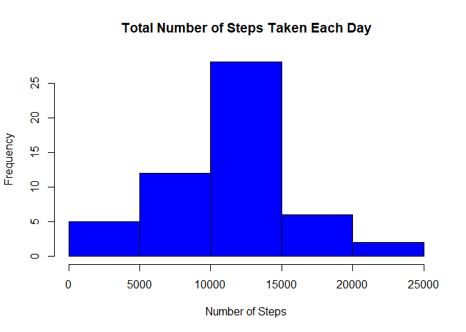
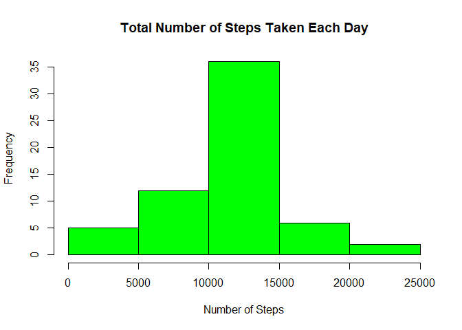
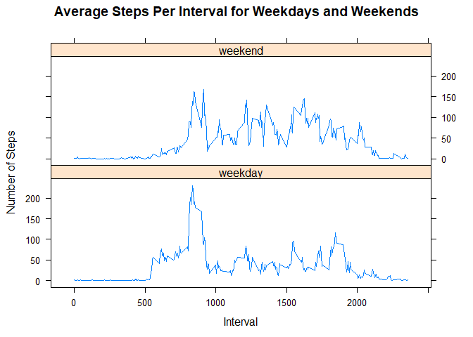

```r
#include libraries
library(tidyverse)
library(lattice)
#set global options
knitr::opts_chunk$set(echo = TRUE)
```

## Loading and preprocessing the data
Data was read using read.csv after checking that the dataset file exists in the working directory. If the file did not exist then an error was displayed stating the name of the file.

```r
workingdir <- getwd()
file <- dir(path = workingdir, pattern ="^activity\\.csv$")
if(length(file) == 1) activity_data <- read.csv(file, header = TRUE, sep = ",") else  stop("File Missing : activity.csv")
```
Dates were converted date class.

```r
activity_data$date <- as.Date(activity_data$date, format = "%Y-%m-%d")
```
A tidy dataset thus obtained was used for further analysis.

## What is mean total number of steps taken per day?


Total Number of steps were calculated

```r
steps_per_day <- aggregate(steps ~ date, activity_data, sum, na.rm = TRUE)
```
A histogram of the total number of steps taken each day was created.


```r
hist(steps_per_day$steps, col = "blue", main = "Total Number of Steps Taken Each Day", xlab = "Number of Steps")
```

<!-- -->

The mean and median of the total number of steps taken per day was calculated. The value of the mean  is as follows:

```r
mean(steps_per_day$steps)
```

```
## [1] 10766.19
```

```r
median(steps_per_day$steps)
```

```
## [1] 10765
```
## What is the average daily activity pattern?

Average steps per interval was calculate and plotted.

```r
avg_steps_int <- aggregate(steps ~ interval, activity_data, mean)
with(avg_steps_int, plot(interval, steps, type = "l"))
```

<!-- -->

Maximum number of steps were calculated and then the interval of the day which had the maximum number of steps (average) was obtained. Interval with maximum number of steps is reported below:

```r
max_steps <- avg_steps_int[avg_steps_int$steps == max(avg_steps_int$steps),]
max_steps[, 1]
```

```
## [1] 835
```
## Imputing missing values

 Total number of missing values in the dataset are as follows:

```r
sum(is.na(activity_data))
```

```
## [1] 2304
```
The mean for that 5-minute interval was chosen to be imputed in the place of missing value. This was mainly due to the fact that some of the days did not have any values for steps reported. Hence, it was not possible to use mean of the steps for that day. The new imputed values depended on the particular 5 minute interval of the value.

A new dataset that is equal to the original dataset was first created. The missing values were filled in according to the above stratergy in the next step. All the imputed values were rounded off to give an appropriate representation to the data.

```r
new_activity_data <- data.frame()
new_activity_data <- data.frame(activity_data)

for(i in seq_along(new_activity_data$steps)){
       if(is.na(new_activity_data$steps[i])){
               mean_int_steps <- filter(avg_steps_int, avg_steps_int$interval == new_activity_data$interval[i])
               new_activity_data$steps[i] <-  ceiling(mean_int_steps[,2]) 
               
       }
}
```

A histogram of the total number of steps taken each day was created and The mean and the median of the steps per day of the new dataset is as follows: The values of mean and median are somewhat different from the original dataset. The values of mean and median seem to increase slightly in the dataset with missing data filled in. 


```r
new_steps_per_day <- aggregate(steps ~ date, new_activity_data, sum, na.rm = TRUE)

hist(new_steps_per_day$steps, col = "green", main = "Total Number of Steps Taken Each Day", xlab = "Number of Steps")
```

<!-- -->

```r
mean(new_steps_per_day$steps)
```

```
## [1] 10784.92
```

```r
median(new_steps_per_day$steps)
```

```
## [1] 10909
```
## Are there differences in activity patterns between weekdays and weekends?

A new column 'wday' (factor) was added to the dataset. Weekdays function was used to obtain the weekday for each unique date in the dataset. The wday variable column was thus populated with a loop as follows.

```r
wday <- as.character()

for(i in seq_along(new_activity_data$date)){
        if(weekdays(new_activity_data$date[i]) %in% c("Saturday", "Sunday")){
                wday[i] <- "weekend"
        }else{
                wday[i] <- "weekday"
        }
}

new_activity_data$wday <- wday
new_activity_data$wday <- as.factor(new_activity_data$wday)
```
A time series line plot was created with 5-minute intervals on the x-axis and the number of steps on the y-axis. The resulting plot was divided into two facets using the wday factor variable, so that it is easier to determine the difference in the pattern of steps per 5 minute interval during a weekday and the weekend.


```r
day_activity_avg <- aggregate(new_activity_data[,1], list(new_activity_data$wday, new_activity_data$interval), mean)

names(day_activity_avg) <- c("wday", "interval", "steps")

xyplot(steps ~ interval | factor(wday), data=day_activity_avg, type = "l", main="Average Steps Per Interval for Weekdays and Weekends", xlab="Interval", ylab="Number of Steps", layout=c(1,2))
```

<!-- -->
